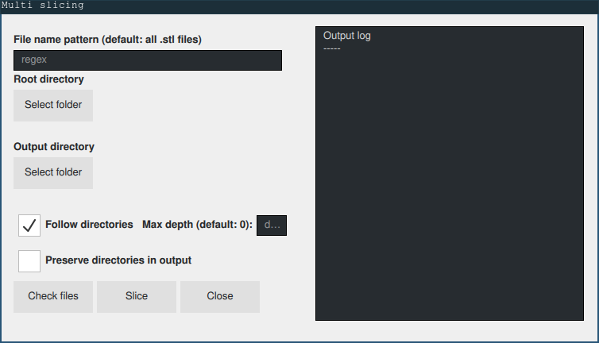

# CuraMultiSlice

A plugin for the slicing software [Cura](https://ultimaker.com/software/ultimaker-cura) by Ultimaker.
This plugin allows the user to load, slice, and export gcode files for a series of model files. 
Model files are found by the plugin based on an input directory and a regex file pattern. 

Every model will be sliced with the settings that are currently applied in the main window of Cura.

## TODO
- add cancel button
- add close button
- ensure cross platform compatibility

## Installation

### UNIX-based systems

```bash
# clone the repository and change directory
$ git clone https://github.com/Badgie/CuraMultiSlice.git
$ cd CuraMultiSlice

# setup the directory structure in the cura plugin directory
# on linux systems, this is usually ~/.local/share/cura/<VERSION>/plugins
# note that it is important to make both directories
$ mkdir -p /path/to/cura/plugins/MultiSlice/MultiSlice

# copy the necessary files to the plugin directory
$ cp __init__.py /path/to/cura/plugins/MultiSlice/MultiSlice
$ cp MultiSlice.py /path/to/cura/plugins/MultiSlice/MultiSlice
$ cp MultiSliceView.qml /path/to/cura/plugins/MultiSlice/MultiSlice
$ cp plugin.json /path/to/cura/plugins/MultiSlice/MultiSlice
```

MultiSlice is now installed, and can be found in the "Extensions" menu item in Cura.

### Windows
TBA


## Usage
To access MultiSlice navigate to `Extensions > MultiSlice > Configure and run` in the toolbar menu. The following dialog should pop up:



### File name pattern
The file name pattern should be a regex that defines the name of the files that should be searched for.

Leaving this field blank will default to using `.*.stl`, i.e. every file found with the `.stl` suffix.

### Root directory
The root directory is the directory to search for files in.

### Output directory
The output directory is where the `.gcode` files are written to.

### Follow directories
The *Follow directories* checkbox will enable/disable traversal of sub-directories when searching for files.

Checking this option will enable two more options; *Max depth* and *Preserve directories in output*

#### Max depth
The *Max depth* field will take an integer between 0 and 9 (inclusive). This value denotes the maximum depth of nested directories that MultiSlice will traverse.

Leaving this field blank will default to using 0, i.e. only the root directory will be searched.

#### Preserve directories in output
The *Preserve directories in output* checkbox will enable/disable preserving the same directory structure in the output directory as it was in the root directory.

## Example

For the following, assume
- a regex file pattern `some_.*.stl`, i.e. any `.stl` file prefixed with `some_`
- `/some/input/directory` as the root directory
- `/some/output/directory` as the output directory

Also assume that `/some/input/directory` contains
```
/some/input/directory
--- some_nested_directory
|     --- another_nested_directory
|     |     --- some_doubly_nested_file.stl
|     |     --- another_doubly_nested_file.stl
--- another_nested_directory
|     --- some_nested_file.stl
|     --- another_nested_file.gcode
--- some_file.stl
--- some_cooler_file.stl
--- another_file.stl
```

Running MultiSlice without further settings would produce the following
```
/some/output/directory
--- some_file.gcode
--- some_cooler_file.gcode
```

### Follow directories
Running MultiSlice with *Follow directories* enabled and no further settings will produce the same result as above.

#### Max depth
Running MultiSlice with a max depth of 1 will produce the following
```
/some/output/directory
--- some_file.gcode
--- some_cooler_file.gcode
--- some_nested_file.gcode
```
and a max depth of 2 will produce the following
```
/some/output/directory
--- some_file.gcode
--- some_cooler_file.gcode
--- some_nested_file.gcode
--- some_doubly_nested_file.gcode
```

#### Preserve directories in output
Running MultiSlice with *Preserve directories in output* enabled and a max depth of 1 will produce the following
```
/some/output/directory
--- another_nested_directory
|     --- some_nested_file.gcode
--- some_file.gcode
--- some_cooler_file.gcode
```
and a max depth of 2 will produce the following
```
/some/output/directory
--- some_nested_directory
|     --- another_nested_directory
|     |     --- some_doubly_nested_file.gcode
--- another_nested_directory
|     --- some_nested_file.gcode
--- some_file.gcode
--- some_cooler_file.gcode
```